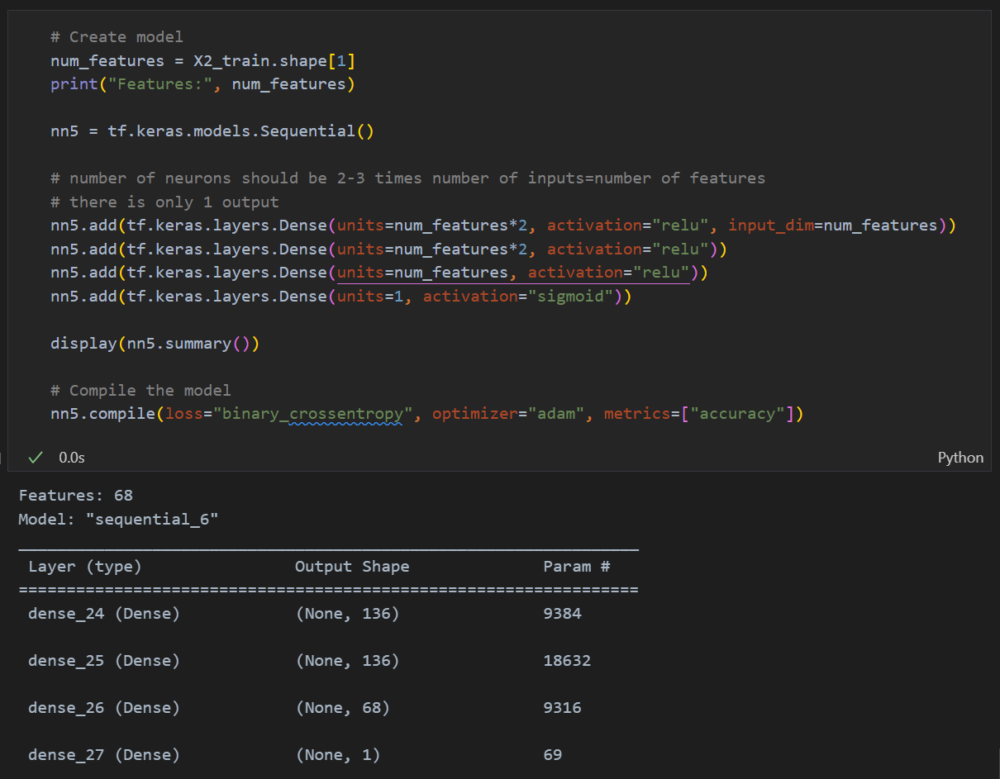
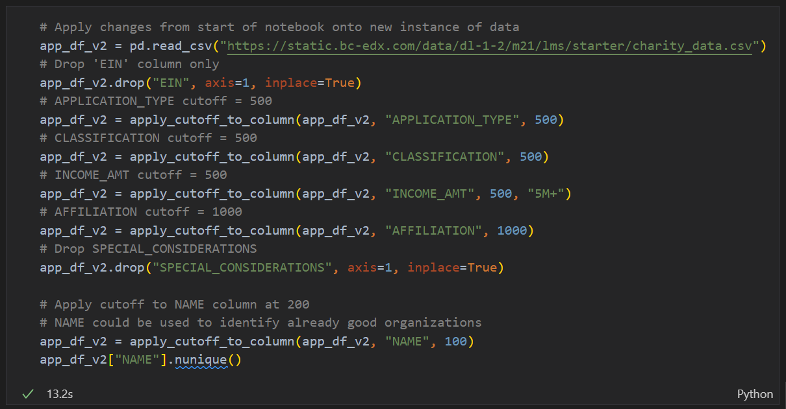
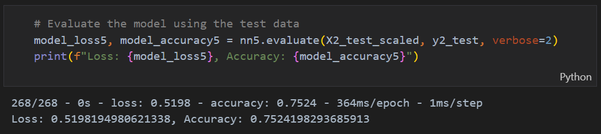

# Challenge 21 - Deep Learning

This challenge displays the use of a Neural Network to create a binary classifier that can predict whether applicants will be successfully funded by a nonprofit foundation. There are two Jupyter notebooks for this project. [AlphabetSoupCharity.ipynb](AlphabetSoupCharity.ipynb) contains the process for creating a starting neural network. [AlphabetSoupCharity_Optimization.ipynb](AlphabetSoupCharity_Optimization.ipynb) contains five different models with different features and hyper parameters in an attempt to optimize the neural network to achieve 75% accuracy or better. This was successful on the last model.

A report on the neural network is included below.

Two models were saved (one from each notebook) and can be found in the `models/` directory.

 
 

# Report on the Neural Network
## Overview
The purpose of this analysis was to create a neural network to classify applicants seeking funding from a nonprofit foundation as likely to be successful or not.

The results below are for the most optimized model (`Attempt 5`) in [AlphabetSoupCharity_Optimization.ipynb](AlphabetSoupCharity_Optimization.ipynb)

## Results:
### Data Preprocessing
- The target for the model is the `IS_SUCCESSFUL` column of the data.
- The variables for the model are the remaining 11 columns in the data.
- Two variables were removed from the input data.
    - The `EIN` column is a unique identifier for every row
    - The `SPECIAL_CONSIDERATIONS` column has been removed because less than 0.1% of applicants have this as True and presumably if it is True, the application will get a special individualized look anyways.
    - NOTE: The original model removed the `NAME` column, the best optimized model kept it, (though only the top 30 Names remained after binning). Keeping this column was the only method I found to achieve at least 75% accuracy.

### Compiling, Training, Evaluating
- The best optimized model had 4 total layers
    - The input and first hidden layer had twice the number of features as neurons and used the `relu` activation function
        - 2x the number of features was chosen as the standard amount of neurons if 2-3 times the number of features
    - The third layer had the same number of neurons as features and used the `relu` activation function
        - 1x the number of features was chosen for this layer to help speed up training
    - The output layer had 1 neuron with a `sigmoid` activation function because the output was a binary 0 or 1

    

- I was able to achieve the target performance of 75% with the 5th model, all other models and the original had an accuracy of around 72.5%.
- To get this accuracy, I kept the `NAME` column as described above as well as added an extra layer to the model. I also binned the `INCOME_AMT` and `AFFILIATION` columns to reduce some of their smallest categories into a single group.

### Summary
Overall, the model reached its target accuracy of 75%. Improvements to this model could be done with `keras-tuner` hyperparameter optimization or by better cleaning of the data. Keeping `NAME` was the only way I found to get to 75%. Different combinations of layers and neurons, adding more binned features, as well as using `keras-tuner` did not meaningfully improve the model as show with Attempts 1-4.

There may also be a different type of model or activation function that I am not currently aware of that may be better suited for this problem.

